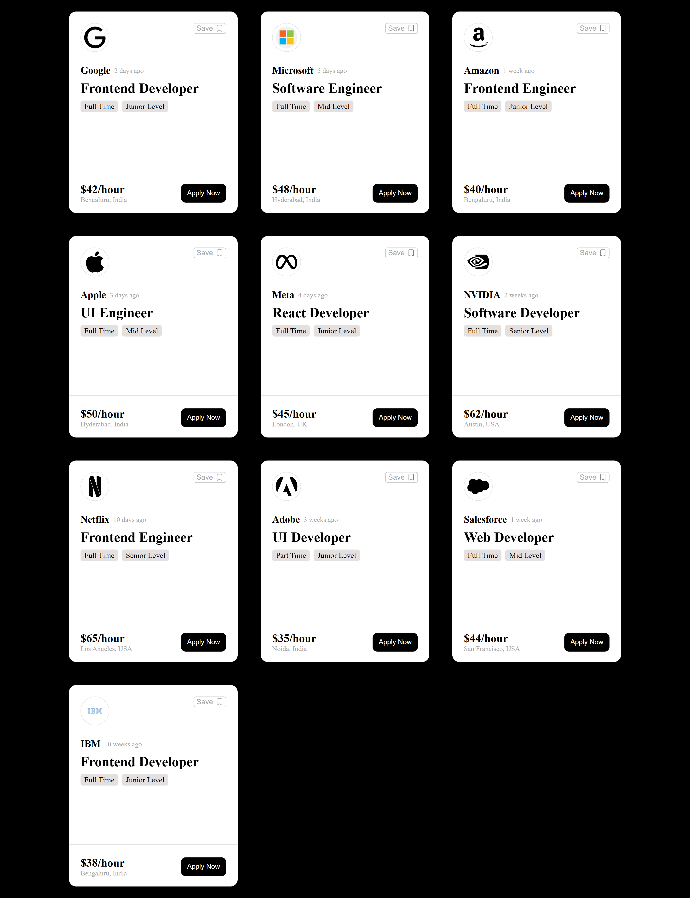
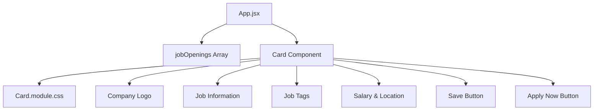

# Job Cards UI

A responsive React job-card interface that displays job openings in a clean, structured layout. Each card presents company information, posting details, employment type, experience level, compensation, location, and quick actions.


## Table of Contents

* [Preview](#preview)
* [Features](#features)
* [Tech Stack](#tech-stack)
* [Project Structure](#project-structure)
* [Component Structure](#component-structure)
* [How It Works](#how-it-works)
* [Key Implementation](#key-implementation)
* [Getting Started](#getting-started)
* [Available Scripts](#available-scripts)
* [Design Highlights](#design-highlights)
* [Author](#author)


## Preview

Click the preview to visit the live page 👇

[](https://hadiashah01.github.io/react-card-components/)


## Features

* Responsive job-card layout
* Company logo and hiring information
* Job posting date and role details
* Employment type and experience-level tags
* Hourly compensation and location details
* Save Job button with Lucide bookmark icon
* Apply Now call-to-action
* Reusable React `Card` component
* Job data rendered dynamically from an array
* CSS Modules for component-level styling

## Tech Stack

* React
* Vite
* JavaScript
* CSS
* CSS Modules
* Lucide React
* Git & GitHub

## Project Structure

```text
job-cards/
├── public/
│   └── preview-images
├── src/
   ├── components/
   │   ├── Card.jsx
   │   └── Card.module.css
   ├── App.jsx
   ├── App.css
   └── main.jsx
```

## Component Structure



## How It Works

The job data is stored in the `jobOpenings` array inside `App.jsx`. The application uses JavaScript's `map()` method to iterate through the available jobs and render a reusable `Card` component for each entry.

Each job's information is passed to `Card` through props, allowing the same component structure to display different companies, roles, locations, compensation, and job attributes.

The card styling is handled through CSS Modules, keeping the component-specific styles scoped to `Card.jsx`.

## Key Implementation

### Dynamic Card Rendering

```jsx
{jobOpenings.map((jobOpening, idx) => {
  return (
    <div key={idx}>
      <Card
        datePosted={jobOpening.datePosted}
        post={jobOpening.post}
        company={jobOpening.company}
        logo={jobOpening.brandlogo}
        tag1={jobOpening.tag1}
        tag2={jobOpening.tag2}
        pay={jobOpening.pay}
        location={jobOpening.location}
      />
    </div>
  );
})}
```

### Reusable Card Component

```jsx
const Card = (jobOpening) => {
  return (
    <div className={styles.card}>
      {/* Job card content */}
    </div>
  );
};
```

## Getting Started

### Clone the repository

```bash
git clone https://github.com/hadiashah01/react-card-components.git
```

### Navigate to the project

```bash
cd react-card-components
```

### Install dependencies

```bash
npm install
```

### Start the development server

```bash
npm run dev
```

The application will be available at the local development URL provided by Vite.

## Available Scripts

| Command           | Description                        |
| ----------------- | ---------------------------------- |
| `npm run dev`     | Starts the Vite development server |
| `npm run build`   | Creates a production build         |
| `npm run preview` | Previews the production build      |
| `npm run lint`    | Runs ESLint                        |

## Design Highlights

* Clean card-based job listing interface
* Clear visual hierarchy between company, role, and job metadata
* Compact tags for employment type and experience level
* Separated footer section for compensation and application action
* Reusable component structure for multiple job listings
* Scoped CSS styling through CSS Modules

## Author

**Hadia Shahjahan**

* GitHub: [@hadiashah01](https://github.com/hadiashah01)
* LinkedIn: [Hadia Shahjahan](https://linkedin.com/in/hadia-shahjahan)


If you found this project useful, feel free to explore the repository and connect with me on GitHub or LinkedIn.
